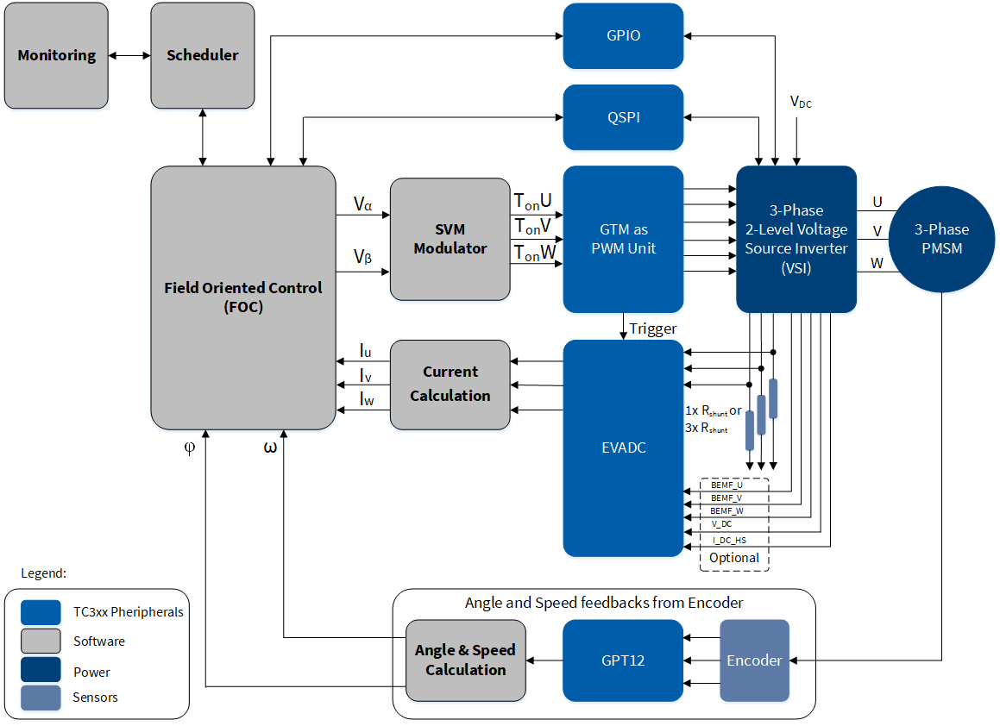
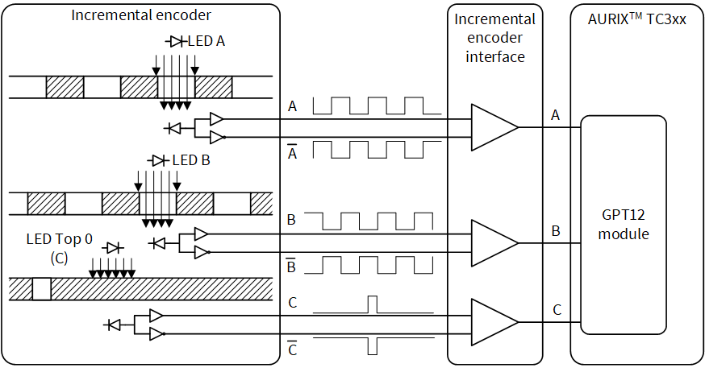
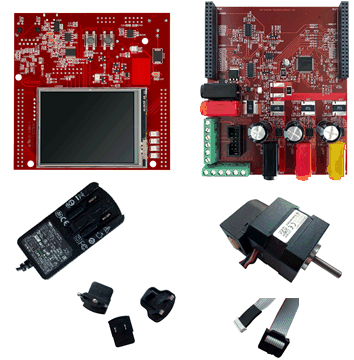
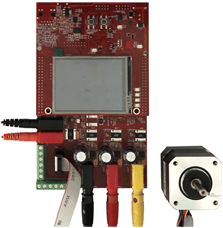
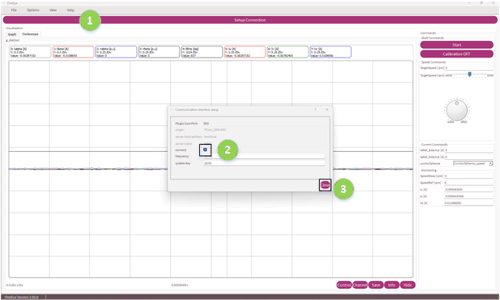
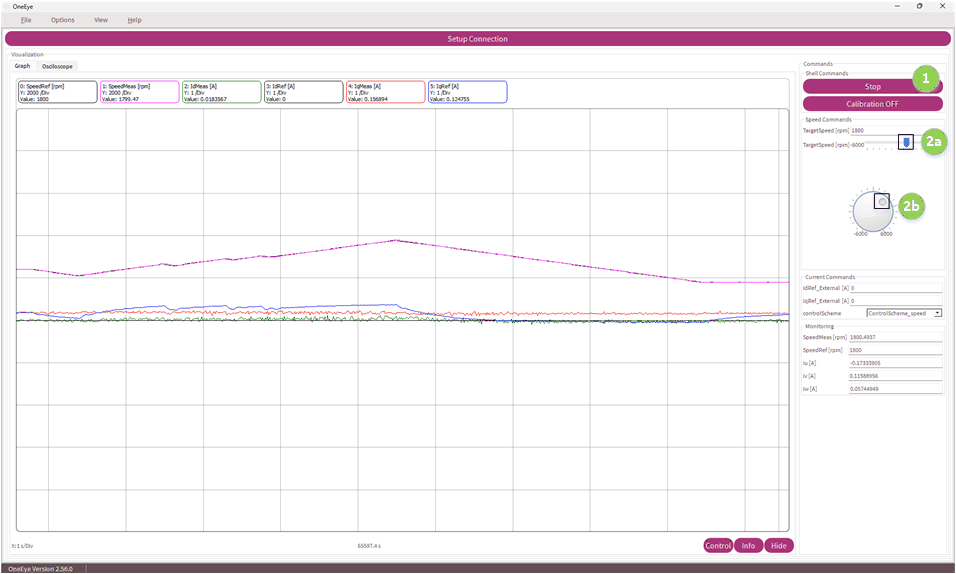
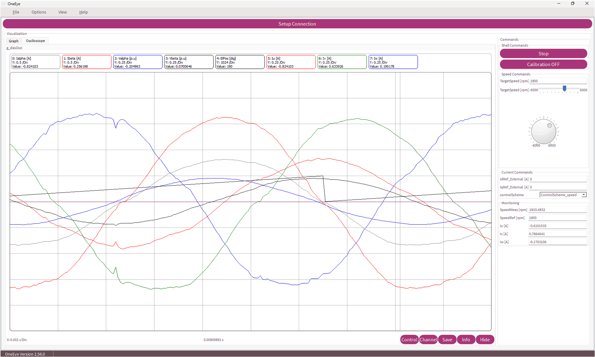
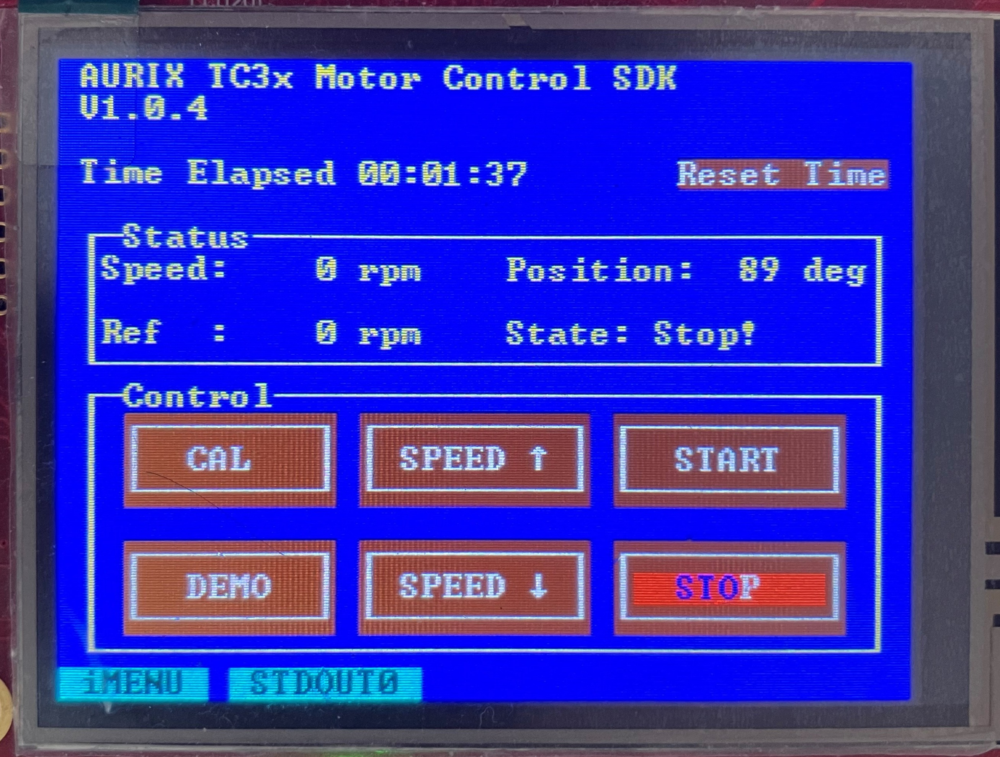

  

# AURIX_TC3x_Motor_Control_SDK 
 
** This example describes the implementation of Permanent Magnet Synchronous Motors (PMSM) Field Oriented Control (FOC) software for a 3-phase motor using the Infineon AURIX&trade; TC3x microcontroller.**  

## Device
The device used in this example is AURIX&trade; TC38xQP_A-Step

## Board
The board used for testing is the AURIX™ T387 Application Kit with TFT (KIT_A2G_TC387_5V_TFT)  

## Scope of work  
The intention of this software development kit (SDK) is to offer functionality to drive Permanent Magnet
Synchronous Motors (PMSM) in sensor mode using AURIX™ TC3x devices. It contains all the common modules
necessary for the modes as generic drives, and provides a high level of configurability and modularity
to address different segments. The Field Oriented Control (FOC) is a method of motor control to generate
three phase sinusoidal signals which can be easily controlled with frequency and amplitude in order to
minimize the current, which in turn means to maximize the efficiency. The basic idea is to transform
three phase signals into two rotor-fix signals and vice-versa.

With this example, FreeRTOS&trade; is integrated. The operating system functions can only be used with TriCore&trade; CPU0.

## Introduction  

The **Field Oriented Control (FOC)** is a method of motor control to generate three phase sinusoidal signals which can be easily controlled with frequency and amplitude in order to minimize the current, which in turn means to maximize the efficiency. The basic idea is to transform three phase signals into two rotor-fix signals and vice-versa.

Feedback on rotor position and rotor speed is required in FOC motor control. The feedback can come from sensorless mechanism or from sensors:

-   Sensorless FOC derives the rotor position and rotor speed based on motor modeling, the voltage applied to the motor phases, and the current in the three motor phases

-  FOC with sensors determines the rotor position and rotor speed from rotor sensor(s), such as Hall sensors or an encoder

Feedback on the phase currents can be sensed in the motor phase, in the leg shunt or DC-Link shunt at the low-side MOSFET. In this software, phase current sensing is expected from the leg shunts.
In the figure bellow one can see the typical block diagram for the PMSM FOC, where single shunt and three shunt low-side current sensing are supported.

  

In this PMSM FOC motor control software, used AURIX&trade; TC3x hardware peripherals are listed in the following table:

<table>
    <tbody>
        <tr>
            <td><b>Peripheral</b></td>
            <td><b>Usage </b></td>
      </tr>
      <tr>
            <td>Queued Synchronous Peripheral Interface (<b>QSPI</b>)</td>
            <td>Communication with external devices (e.g. TLE9180)</td>
      </tr>
      <tr>
            <td>General Purpose Timer Unit (<b>GPT12</b>)</td>
            <td>Incremental encoder support</td>
      </tr>
      <tr>
            <td>Generic Timer Module (<b>GTM</b>) (optional)</td>
            <td>PWM generation and triggering of ADC channels</td>
      </tr>
      <tr>
            <td>Enhanced Versatile Analog-to-Digital Converter (<b>EVADC</b>)</td>
            <td>Phase current and DC-link voltage sensing</td>
      </tr>
    </tbody>
</table>

**Communication with external devices**

The TLE9180D-31QK, an advanced gate driver IC, is used in motor control power board. The TLE9180D-31QK is dedicated to control 6 external N-channel MOSFETs forming an inverter for high current 3 phase motor drive application in the automotive sector.  An integrated **Queued Synchronous Peripheral Interface (QSPI)** interface is used to configure the TLE9180D-31QK for the application after power-up. After successful power-up, adjusting parameters, monitoring data, configuration and error registers can be read through QSPI interface. Cyclic redundancy checks over data and address bits ensures safe communication and data integrity. The QSPI enables synchronous serial communication with external devices based on the standardized SPI-bus signals: clock, data-in, data-out and slave select. The QSPI works in full duplex mode either as Master or Slave with up to 50 MBit/s. 

**Incremental encoder support**

An **incremental encoder** contains LED emitters, integrated circuits with light detectors and output circuitry. A disk with a markings pattern on its surface rotates between the emitter and detector IC, thus allowing and blocking the light of the emitter from reaching the detector IC. The outputs of the detector IC could be single-ended and differential signals. There are three output signals. Two of them provide a square wave signal with a 90-degree phase shift. The third one generates once per revolution a short pulse for synchronization.

  

The **General Purpose Timer Unit (GPT12)** consists of two GPT blocks (GPT1 and GPT3). Each block has a multifunctional timer structure which incorporates several 16-bit timers.

Block GPT1 contains three timers: The core timer T3 and two auxiliary timers T2 and T4.Each timer of block GPT1 can run in one of four modes: Timer Mode, Gated Timer Mode, Counter Mode or **Incremental Interface Mode**. All timers can count up or down.

Block GPT2 contains two timers: The core timer T6 and auxiliary timer T5. Both timers T5 and T6 of block GPT2 can run in one of 3 basic modes: Timer Mode, Gated Timer Mode, or Counter Mode. All timers can count up or down.

**PWM generation and triggering of ADC channels**

The **Generic Timer Module (GTM)** is a modular timer unit designed to accommodate many timer applications.

It has an in-built Advanced Router Unit (ARU) that can be used to exchange specific data between sub-modules without CPU interaction.

The ATOM, which is part of the GTM, is able to generate complex output signals.

The Clock Management Unit (CMU) is responsible for clock generation of the GTM. The Configurable Clock Generation Subunit (CFGU) provides eight clock sources for the GTM submodules: TIM, TBU, MON and ATOM.

**Phase current and DC-link voltage sensing**

The **Enhanced Versatile Analog-to-Digital Converter (EVADC)** provides a series of analog input channels connected to several clusters of Analog/Digital Converters using the Successive Approximation Register (SAR) principle to convert analog input values (voltages) to discrete digital values.

**The key features**

The key features supported are listed in the following table:

<table>
    <tbody>
        <tr>
            <td><b>Framework & Handling</b></td>
            <td>Task scheduler, Motor control state machine, </td>
        </tr>
        <tr>
            <td><b>Peripheral driver</b></td>
            <td>Microcontroller specific low-level driver (iLLD)</td>
        </tr>
        <tr>
            <td><b>Math Control Blocks</b></td>
            <td>Clarke and Park transformations, Id and Iq current PI controllers, speed PI controller, sine, cosine, tan, atan, sqrt, ramp function</td>
        </tr>
        <tr>
            <td><b>Control Scheme</b></td>
            <td>Speed control and current control</td>
        </tr>
        <tr>
            <td><b>Space Vector Modulation (SVM)</b></td>
            <td>7-segment SVM</td>
        </tr>
        <tr>
            <td><b>Device Feature</b></td>
            <td>ADC synchronous conversion: motor phase current sensing (2 or 3 shunts) and DC-link voltage sensing</td>
        </tr>
        <tr>
            <td><b>Gate driver support</b></td>
            <td>TLE9180D</td>
        </tr>
        <tr>
            <td><b>Rotor Speed and Angle Calculation</b></td>
            <td>Incremental encoder as position sensor with automatic calibration procedure</td>
        </tr>
    </tbody>
</table>

**FreeRTOS™**: Real-time operating system for microcontrollers. <https://www.freertos.org>  
It is a market-leading real-time operating system (RTOS) for microcontrollers and small microprocessors. Distributed freely under the MIT open source license.  
  
With this example, only the kernel and required port files are extracted. To use the TriCore™ port to work with AURIX™ TC3x microcontrollers, following files are updated:  
- portable/TriCore/port_tricore.h
- portable/TriCore/port.c
- portable/TriCore/portmacro.h

## Hardware setup  
This code example has been developed for the KIT_A2G_TC387_MOTORCTR. It cosnsists of: KIT_A2G_TC387_5V_TFT, power board (inverter), BLDC motor with incremental encoder and power supply:

  

## Implementation

The project is divided into application software (AppSw), libraries (Libraries) and operating system software (OS). The application software consists of configuration (Configuration), GUI application (OneEye), operating system tasks (OSTasks) and PMSM FOC software (PmsmFoc). The folder Libraries consist of AURIX&trade; TC387 low level drivers (iLLD), infrastructure, service and external device driver libraries (e.g. TLE9180).

The PMSM FOC motor control application software is developed based on a well-defined layered approach. The layered architecture is designed in such a way as to separate the modules into groups. This allows different modules in a given layer to be easily replaced without affecting the performance in other modules and the structure of the complete system.

When using iLLDs, the configuration of modules can be done using a structure storing the needed parameters. Such structures are provided by iLLDs together with APIs that can be used to fill them with default values. The user can then modify the configuration as needed and apply it. 

**Configuring the GTM TOM**

Source file [Gtm_Init.c](AppSw/PmsmFoc/MCUInit/Gtm_Init.c) provides the configuration for GTM.

** EVADC configuration**

Source file [Evadc_Init.c](AppSw/PmsmFoc/MCUInit/Evadc_Init.c) provides the configuration for EVADC.

**The current sense EVADC Interrupt Service Routine (ISR)**

The current sense EVADC ISR implemented in this example is used to execute complete motor control application. 

**Initialization of the operating system**
Initialization of FreeRTOS&trade; is done at Cpu0_Main.c::core0_main.

**QSPI Master initialization** 

Source file [Qspi_Init.c](AppSw/PmsmFoc/MCUInit/Qspi_Init.c) provides the configuration for QSPI.

**TLE9180 software driver initialization** 

Source file [PmsmFoc_InitTLE9180.c](AppSw/PmsmFoc/ExtDevInit/PmsmFoc_InitTLE9180.c) provides the configuration for EVADC.

The initialization of the TLE9180 software driver is done using an instance of the structure *IfxTLE9180_Config*. The GPIO pins are set and  propper QSPI channel assigned. The function *IfxTLE9180_init()* is used to initialize the TLE9180 software driver.  

Table below provides the predefined startup configuration of TLE9180D-31QK. More details about available registers can be found in datasheet of TLE9180D-31QK.

<table>
    <tbody>
        <tr>
            <td><b>Register short name</b></td>
            <td><b>Data [hex] </b></td>
            <td><b>Description </b></td>            
      </tr>
      <tr>
            <td>Conf_Sig </td>
            <td>AC </td>
            <td>CRC8 Signature Byte </td>            
      </tr>
            <tr>
            <td>Conf_Gen_1 </td>
            <td>81 </td>
            <td>140°C, Input Pattern Supervision Disabled, SPI Window Watchdog Disabled, Limp Home Mode Activation Disabled, VCC Supervision Enabled, VCC Monitoring Threshold - 5V selected as VCC supply voltage 
            </td>            
      </tr>
            <tr>
            <td>Conf_Gen_2 </td>
            <td>0F </td>
            <td>5V Overcurrent Detection Threshold, 0V BSx enabled, 0V LD enabled, 0V SD VDHP enabled, 3 VDH sense pins and 1 VDHP power pin enabled, Current Sense Amplifier 3 enabled, Current Sense Amplifier 2 enabled, Current Sense Amplifier and Reference Buffer enabled </td>            
      </tr>
            <tr>
            <td>Tl_vdh  </td>
            <td>70 </td>
            <td>48.18V VDHP Overvoltage Threshold, 3.96V VDHP Undervoltage Threshold </td>            
      </tr>
            <tr>
            <td>Tl_cbvcc </td>
            <td>9A </td>
            <td>9.99V CB Undervoltage Threshold, VCC Overvoltage Threshold is 10% of configured VCC supply voltage, VCC Undervoltage Threshold is 10% of configured VCC supply voltage </td>            
      </tr>
            <tr>
            <td>Fm_1  </td>
            <td>32 </td>
            <td>CB Undervoltage Failure Behavior - Warning, Overload Charge Pump 2 Failure Behavior - Shutdown of output stages, Undervoltage High-side Buffer Capacitor Failure Behavior - Auto Restart Error </td>            
      </tr>
            <tr>
            <td>Fm_3 </td>
            <td>2A </td>
            <td>Vs Undervoltage Failure - Auto Restart Error, VDHP Undervoltage Failure Behavior - Auto Restart Error, VCC Undervoltage Failure Behavior - Auto Restart Error </td>            
      </tr>
            <tr>
            <td>Fm_4 </td>
            <td>4A </td>
            <td>Vs Overvoltage Failure - Auto Restart Error, VDHP Overvoltage Failure Behavior - Auto Restart Error, VCC Overvoltage Failure Behavior - Auto Restart Error </td>            
      </tr>
            <tr>
            <td>Fm_6 </td>
            <td>2A </td>
            <td>Current Sense Amplifier 3 Overcurrent Failure Behavior - ARE, Current Sense Amplifier 2 Overcurrent Failure Behavior - ARE, Current Sense Amplifier 1 Overcurrent Failure Behavior - ARE </td>            
      </tr>
            <tr>
            <td>Op_gain_1  </td>
            <td>44 </td>
            <td>Current Sense Amplifier 1 Gain 1 - 30.81, Current Sense Amplifier 2 Gain 1 - 30.81 </td>            
      </tr>
            <tr>
            <td>Op_gain_2  </td>
            <td>44 </td>
            <td>Current Sense Amplifier 1 Gain 2 - 30.81, Current Sense Amplifier 2 Gain 2 - 30.81 </td>            
      </tr>
            <tr>
            <td>Op_gain_3  </td>
            <td>44 </td>
            <td>Current Sense Amplifier 3 Gain 2 - 30.81, Current Sense Amplifier 3 Gain 1 - 30.81 </td>            
      </tr>
      </tr>
            <tr>
            <td>Op_0cl  </td>
            <td>9F </td>
            <td>Zero Current Output Voltage Offset - 2.5V, Zero Current Output Voltage Offset Fine Adjustment - No adjustment </td>            
      </tr>
    </tbody>
</table>

The configuration table one can find in [TLE9180.c](Libraries/ExtDevDrivers/TLE9180/Tricore/TLE9180.c) file.

** Configuring GPT12 Module**

Source file [Gpt12_Init.c](AppSw/PmsmFoc/MCUInit/Gpt12_Init.c) provides the configuration for GPT12.

**The GPT12 Interrupt Service Routine (ISR)**

The GPT12 ISR implemented in this example increment or decrement numbers of turns by calling the iLLD function *IfxGpt12_IncrEnc_onZeroIrq()* 

## Compiling and programming
Before testing this code example:  
- Connect all boards and motor with incremental encoder
- Connect the board to the PC through the USB interface
- Power the power board through the dedicated power connector 
- Build the project using the dedicated Build button  or by right-clicking the project name and selecting "Build Project"
- To flash the device and immediately run the program, click on the dedicated Flash button   

  

## Run and Test   
After code compilation and flashing the device perform one of two set of steps:
- GUI based control
- Local control using display and touch screen

##GUI based control

- **Open GUI and setup conncetion**
    - Open OneEye configuration by double clicking on: [AURIX_TC3x_Motor_Control_SDK.OneEye](AURIX_TC3x_Motor_Control_SDK.OneEye)
    - Clik on "Setup connection" buttton (1)
    - Check in connect filed (2)
    - Close window (3)

     

- **Start and set speed reference**
    - Start the motor control by pressing "Start" button (1)
    - Move slider in order to change speed target in rpm (2a) or  
    - Move dial knob in order to change speed target in rpm (2b)  

     

- **Monitor selected varibales in Osciloscope**
    - Select Scope tab
    - Change speed reference and observe varibles

**Note:** The oscilloscope signals are added in [OneEye.c](AppSw/OneEye/OneEye.c) by calling the function *Ifx_Osci_addSignal()* in OneEye_initOneEye().

    

## Local control using display and touch screen

Page: iMENU
- **Software version**
- **Time elapsed**
- **Status**
    - Speed: actual rotor speed in rpm
    - Ref: reference speed in rpm
    - Position: actual rotor position measured by position sensor in deg
    - State: actual control state
- **Control**
    - CAL: trigger calibration routine
    - DEMO: trigger predefined speed reference profile and start motor. Ramp up to 6000 rpm, and than ramp down to 0 rpm
    - SPEED ↑: increase speed reference, 100 rpm step size
    - SPEED ↓: decrease speed reference, 100 rpm step size
    - START: start motor
    - STOP: stop motor

 

## Limitations of use for PMSM FOC software 

At the time of release of this example software, the following limitations in usage apply:
- Only a single motor drive is supported
- Position and speed feedbacks from Hall sensors or resolver are not supported
- This software is developed in AURIX&trade; Development Studio Version: 1.10.10. It is not tested on other IDE (Integrated Development Environment) platforms
- The software is compiled only with integrated TASKING compiler
- TLE9180 driver use predefined values during startup configuration

## References  

AURIX&trade; Development Studio is available online:  
- <https://www.infineon.com/aurixdevelopmentstudio>  
- Use the "Import..." function to get access to more code examples  

More code examples can be found on the GIT repository:  
- <https://github.com/Infineon/AURIX_code_examples>  

For additional trainings, visit our webpage:  
- <https://www.infineon.com/aurix-expert-training>  

For questions and support, use the AURIX&trade; Forum:  
- <https://community.infineon.com/t5/AURIX/bd-p/AURIX>  
